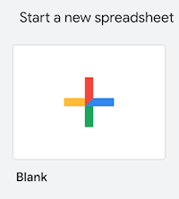
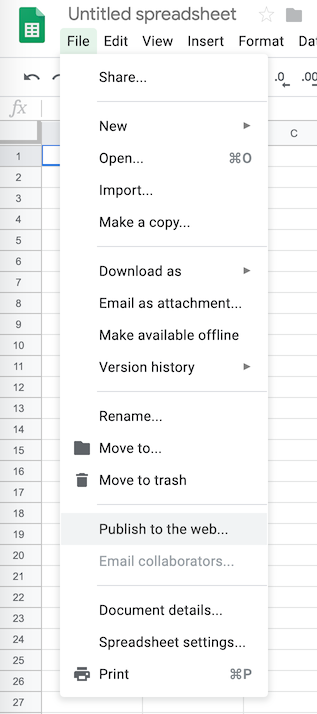
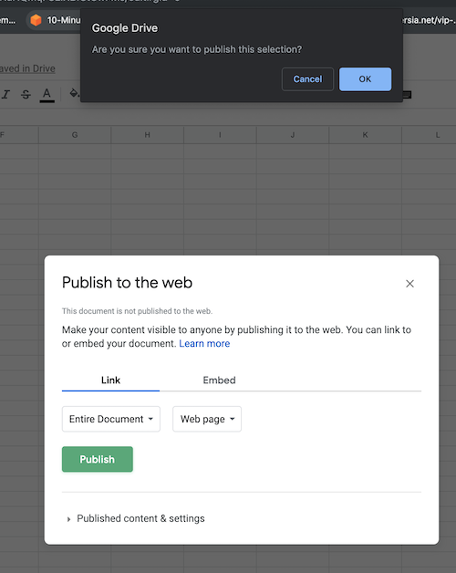
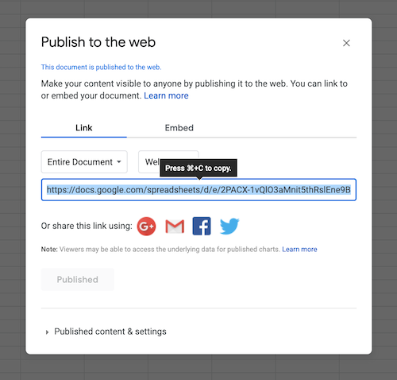
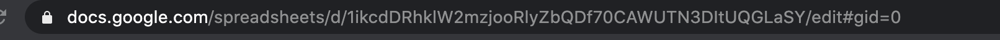
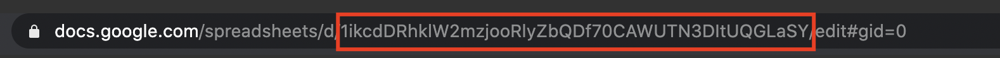

# Read Google Spread Sheet - React Native 

Read Google Spread Sheet display and bind in list


## Section 1
Creating a Google Sheet

####  Step 1 
Go to [Google Sheets](https://docs.google.com/spreadsheets/u/0/).

#### Step 2 : 
Create a new spreadsheet



## Section 2: Publishing your Google Sheets to the web

####  Step 1 
Click **File > Publish to the web…**



#### Step 2
Click **Publish**, then **OK**




#### Step 3
No need to do anything here




## Section 3: Using your Google Sheets as JSON endpoint
#### Step 1


[https://spreadsheets.google.com/feeds/list/YOURGOOGLESHEETCODE/SHEETPAGENUMBER/public/values?alt=json](https://spreadsheets.google.com/feeds/list/YOURGOOGLESHEETCODE/SHEETPAGENUMBER/public/values?alt=json)

#### Step 2:

Go to your opened Google Sheets and check the address bar






#### Step 3:

Go to the template URL and replace

**YOURGOOGLESHEETCODE** with ```1ikcdDRhklW2mzjooRlyZbQDf70CAWUTN3DItUQGLaSY```

**SHEETPAGENUMBER** to ```1```

#### Step 4:

Retrieve JSON URL

***[https://spreadsheets.google.com/feeds/list/1ikcdDRhklW2mzjooRlyZbQDf70CAWUTN3DItUQGLaSY/1/public/values?alt=json](https://spreadsheets.google.com/feeds/list/1ikcdDRhklW2mzjooRlyZbQDf70CAWUTN3DItUQGLaSY/1/public/values?alt=json)***

